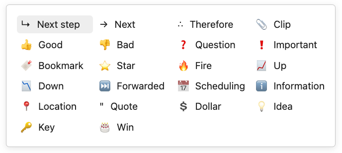
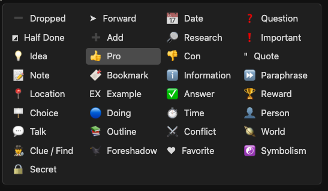

## Checkbox styling helper

The is a Obsidian plugin that helps you styling checkboxes in preview mode.

If the theme you are using...

#### Things theme

Be sure to check to use the [Things theme](https://github.com/colineckert/obsidian-things) in the settings.

#### Else (including default theme)

If you are not using the Things theme, be sure to add the CSS of the [ITS theme](https://github.com/SlRvb/Obsidian--ITS-Theme/blob/main/Snippets/S%20-%20Checkboxes.css) to the CSS Snippet.

The styles provided by the [ITS theme](https://publish.obsidian.md/slrvb-docs/ITS+Theme/ITS+Theme) can be found [here](https://publish.obsidian.md/slrvb-docs/ITS+Theme/Alternate+Checkboxes).

### Usage

Just add `:` to the right of Unordered Lists or checkboxes!

You can create a checkbox with the desired icon by clicking with the mouse or selecting the desired icon with the arrow keys and then pressing Spacebar.

### Demo video

### Available icons(Things theme)

### Available icons(Else theme)(ITS style)

## We Need Your Help

This plugin originated from the idea of explicitly writing text by changing the header shape of Markdown's unordered lists into icons. Despite investing a lot of time in development and learning, the plugin was released with some limitations due to my limited skills. The limitations I've identified are as follows:

1. **Icons do not revert on click**: As the styling is based on checkboxes, clicking an icon results in it being "unchecked," and the designated style disappears. The icons in unordered lists should not be clickable to prevent this.
2. **Difficulty in adding icons**: The process of adding desired icons is complicated since it uses checkbox styling. It requires basic knowledge of JavaScript and CSS.
3. **Keyboard not confined to the popup window**: For convenience, icons can be selected using the keyboard. However, the arrow keys move not only within the popped-up icon window but also on the page itself. Like the Tasks plugin, the keyboard should operate only within the popup.
4. **Cannot select icons using Enter**: Due to issue three, pressing Enter also inserts an Enter (`\n`) on the page, leading to disorganized text.

I seek advice and solutions that can help resolve these issues to create a better plugin that many people will enjoy using. Thank you!
