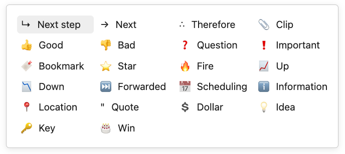

## Checkbox styling helper

The is a Obsidian plugin that helps you styling checkboxes in preview mode.

If the theme you are using...

#### Things theme

Be sure to check to use the [Things theme](https://github.com/colineckert/obsidian-things) in the settings.

#### Else (including default theme)

If you are not using the Things theme, be sure to add the CSS of the [ITS theme](https://github.com/SlRvb/Obsidian--ITS-Theme/blob/main/Snippets/S%20-%20Checkboxes.css) to the CSS Snippet.

The styles provided by the [ITS theme](https://publish.obsidian.md/slrvb-docs/ITS+Theme/ITS+Theme) can be found [here](https://publish.obsidian.md/slrvb-docs/ITS+Theme/Alternate+Checkboxes).

### Demo video

### Available icons

